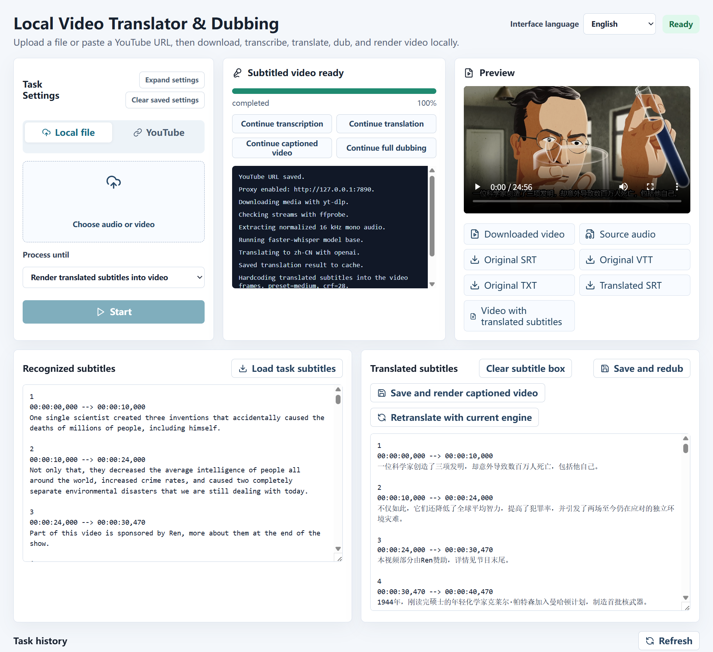

# Local Voice Pro

[简体中文文档](README.zh-CN.md)

Local Voice Pro is a local web tool for video transcription, subtitle translation, dubbing, and captioned video rendering. It is inspired by the workflow of Voice-Pro, but this project focuses on a smaller, easier-to-run local pipeline built with FastAPI and React.

## Preview



## What It Does

- Upload local audio or video files.
- Download YouTube videos with `yt-dlp`.
- Extract and normalize audio with FFmpeg.
- Transcribe speech into SRT/VTT/TXT subtitles with Faster-Whisper.
- Translate subtitles with Google Translate or an OpenAI-compatible Chat Completions API.
- Cache translation results to avoid paying twice for the same subtitle translation.
- Generate dubbing audio with Edge-TTS, with a local system TTS fallback where available.
- Replace the original video audio track with dubbed audio.
- Burn translated subtitles directly into video frames.
- Stop running jobs from the web UI.
- Continue a job from a later stage, such as download only -> transcribe -> translate -> render.
- Switch the UI between English and Simplified Chinese.

## Use Cases

- Translate a YouTube video into another language.
- Create translated SRT subtitles from local media.
- Render a video with hardcoded translated subtitles.
- Generate a dubbed version of a video for local preview or editing.
- Batch-like iterative workflows where you download first, then decide how far to continue.

## Requirements

- Windows 10/11, macOS, or Linux.
- Python 3.10 or newer.
- Node.js 20 or newer.
- FFmpeg and ffprobe.
  - Windows: install FFmpeg globally or place it in `tools/ffmpeg/bin`.
  - macOS: `brew install ffmpeg`
  - Ubuntu/Debian: `sudo apt update && sudo apt install -y ffmpeg`
- Optional local TTS dependencies:
  - Linux: install `espeak-ng` if you want to use local system TTS, for example `sudo apt install -y espeak-ng`.
  - macOS/Windows: local voices come from the operating system.
- Network access for:
  - YouTube downloads.
  - first-time Whisper model downloads.
  - Google Translate, Edge-TTS, or OpenAI-compatible APIs.

## Quick Start

Clone the repository, then run the startup script for your system.

Windows installer:

1. Download `LocalVoiceProSetup-WithPython.exe` from GitHub Releases.
2. Run it.
3. The installer extracts the app to `%LOCALAPPDATA%\LocalVoicePro`, expands bundled FFmpeg, creates Start Menu shortcuts, starts the local web server, and opens `http://127.0.0.1:8000`.

`LocalVoiceProSetup-WithPython.exe` includes Python and does not require Python or Node.js on the target computer. A smaller `LocalVoiceProSetup.exe` build is also available for users who already have Python 3.10+ installed.

After installation, launch it again from Start Menu -> Local Voice Pro -> Local Voice Pro. A desktop shortcut is also created when Windows allows it.

Windows:

```powershell
.\start.bat
```

macOS/Linux:

```bash
chmod +x start.sh stop.sh scripts/*.sh
./start.sh
```

The scripts will:

- detect local FFmpeg,
- detect the default proxy at `http://127.0.0.1:7890` if available,
- create or reuse `.venv`,
- install backend dependencies,
- install frontend dependencies,
- start the backend at `http://127.0.0.1:8000`,
- start the frontend at `http://127.0.0.1:5173`,
- open the browser automatically.

Stop services:

Windows:

```powershell
.\stop.bat
```

macOS/Linux:

```bash
./stop.sh
```

## Manual Installation

Windows PowerShell:

```powershell
python -m venv .venv
.\.venv\Scripts\python.exe -m pip install --upgrade pip
.\.venv\Scripts\python.exe -m pip install -r backend\requirements.txt

cd frontend
npm.cmd install
cd ..
```

macOS/Linux:

```bash
python3 -m venv .venv
./.venv/bin/python -m pip install --upgrade pip
./.venv/bin/python -m pip install -r backend/requirements.txt

cd frontend
npm install
cd ..
```

Start backend on Windows:

```powershell
powershell -ExecutionPolicy Bypass -File .\scripts\start-backend.ps1
```

Start frontend on Windows:

```powershell
powershell -ExecutionPolicy Bypass -File .\scripts\start-frontend.ps1
```

Start backend on macOS/Linux:

```bash
./scripts/start-backend.sh
```

Start frontend on macOS/Linux:

```bash
./scripts/start-frontend.sh
```

Open:

```text
http://127.0.0.1:5173
```

## Build Windows Installer

On a Windows development machine:

```powershell
powershell -ExecutionPolicy Bypass -File .\packaging\build_windows_setup.ps1
```

Build the larger self-contained installer with bundled Python:

```powershell
powershell -ExecutionPolicy Bypass -File .\packaging\build_windows_setup_with_python.ps1
```

The output is:

```text
dist\LocalVoiceProSetup.exe
dist\LocalVoiceProSetup-WithPython.exe
```

The generated installers include the built frontend and `tools/ffmpeg.zip` when that archive exists locally. The `WithPython` build also includes a portable Python runtime and the installed backend dependencies.

## Proxy

The UI has a proxy setting, defaulting to:

```text
http://127.0.0.1:7890
```

The proxy is used for YouTube downloads, Google Translate, Edge-TTS, and OpenAI-compatible API calls when enabled.

## OpenAI-Compatible Translation

In the UI, expand settings and choose:

```text
ChatGPT / OpenAI-compatible API
```

Then fill in:

- API Key
- Base URL, for example `https://api.openai.com/v1`
- Model, for example `gpt-4o-mini`

The key is saved only in browser localStorage on your machine.

## Generated Files

Each job writes to:

```text
workspace/jobs/{job_id}/
```

Common outputs:

- `source.wav`
- `original.srt`
- `original.vtt`
- `original.txt`
- `translated.srt`
- `dubbed.mp3`
- `dubbed.wav`
- `dubbed_video.mp4`
- `translated_subtitles_video.mp4`
- `manifest.json`

Translation cache is stored in:

```text
workspace/translation-cache/
```

## Notes

- Hardcoded subtitles require re-encoding video. Use CRF and preset settings to balance file size, speed, and quality.
- Local TTS voices depend on voices installed on the operating system. Edge-TTS is the recommended cross-platform default.
- Edge-TTS can be unstable for some voices or networks; use local TTS fallback when needed.
- Faster-Whisper downloads models on first use.
